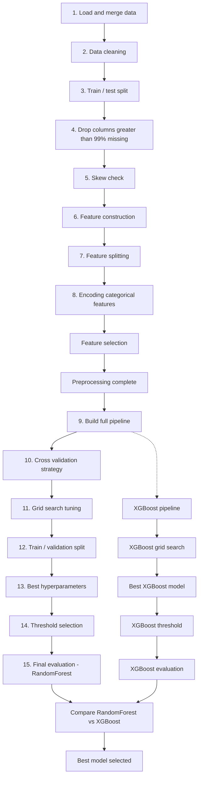

# Fraud Detection Pipeline

A modular machine learning pipeline for detecting fraudulent transactions using the IEEE-CIS fraud detection dataset. The pipeline covers EDA, data cleaning, feature engineering, preprocessing, model training with hyperparameter tuning, threshold optimization, and evaluation — comparing RandomForest and XGBoost classifiers on an imbalanced classification problem.

---

## Pipeline Flow



---

## Project Structure

```
Fraud detection/
│
├── data/
│   ├── train_identity.csv
│   ├── train_transaction.csv
│   └── split_data.py              # Train/test split, train/val split for threshold tuning
│
├── eda/
│   └── explore.py                 # Load, merge, and explore the dataset
│
├── cleaning/
│   └── clean_data.py              # Categorical + numerical data cleaning
│
├── features/
│   ├── drop_high_missing.py       # Drop columns with >99% missing values
│   ├── function_transformer.py    # Skew analysis on numerical features
│   ├── feature_construction.py    # Engineered features (log amount, decimal, UID, UID stats)
│   ├── feature_split.py           # Split columns by type and cardinality
│   └── feature_selection.py       # Tree-based feature selection (SelectFromModel)
│
├── preprocessing/
│   └── encoding_transformer.py    # One-hot / ordinal encoding by cardinality
│
├── modeling/
│   ├── pipeline.py                # Full sklearn Pipeline (RandomForest)
│   ├── cv_strategy.py             # Stratified K-Fold cross-validation
│   ├── tuning.py                  # GridSearchCV (RandomForest)
│   ├── best_model.py              # Extract best estimator from grid search
│   ├── xgb_pipeline.py            # Full sklearn Pipeline (XGBoost)
│   └── xgb_tuning.py              # GridSearchCV (XGBoost)
│
├── threshold/
│   └── threshold_selection.py     # F1-based classification threshold tuning
│
├── evaluation/
│   ├── evaluate.py                # Confusion matrix, precision/recall/F1, ROC-AUC, PR-AUC
│   └── compare_models.py          # Compare RandomForest vs XGBoost on test set
│
├── main.py                        # Orchestrates the full pipeline end-to-end
├── requirements.txt
└── README.md
```

---

## Pipeline Steps Explained

| Step | Stage | File |
|---|---|---|
| 1 | EDA — inspect shape, nulls, duplicates, target relationships | `eda/explore.py` |
| 2 | Data cleaning — standardize categorical values, fix invalid entries | `cleaning/clean_data.py` |
| 3 | Train/test split — stratified, test set held out until final evaluation | `data/split_data.py` |
| 4 | Drop columns with >99% missing values | `features/drop_high_missing.py` |
| 5 | Skew check (informational — tree models are robust to skew) | `features/function_transformer.py` |
| 6 | Feature construction — log amount, decimal part, pseudo user ID, UID stats | `features/feature_construction.py` |
| 7 | Feature splitting — numerical vs categorical, by cardinality | `features/feature_split.py` |
| 8 | Encoding — One-Hot for low-cardinality, Ordinal for high-cardinality | `preprocessing/encoding_transformer.py` |
| — | Feature selection — top ~50% of features by importance | `features/feature_selection.py` |
| 9 | Complete pipeline — all transformers combined with the classifier | `modeling/pipeline.py` |
| 10 | Cross-validation strategy — Stratified K-Fold (3 splits) | `modeling/cv_strategy.py` |
| 11 | Grid search — hyperparameter tuning, optimized for PR-AUC | `modeling/tuning.py` |
| 12 | Train/validation split — separate from grid search, for threshold tuning | `data/split_data.py` |
| 13 | Best hyperparameters and best cross-validated score | `modeling/best_model.py` |
| 14 | Threshold selection — F1-optimized, chosen on the validation set | `threshold/threshold_selection.py` |
| 15 | Final evaluation — full classification metrics on the untouched test set | `evaluation/evaluate.py` |

The same process (steps 9–15) is repeated for an XGBoost model, and the two models are compared by PR-AUC — the most reliable metric for this imbalanced fraud detection problem.

---

## Data Leakage Prevention

- All preprocessing (imputation, encoding, feature selection) happens **inside** the sklearn Pipeline, so it is refit separately on each cross-validation fold — no information from held-out folds or the test set ever influences preprocessing decisions.
- UID-based statistical features (`uid_TransactionAmt_mean`, `uid_TransactionAmt_std`, `Amt_to_mean_ratio`) are computed via a custom transformer (`UIDFeatureTransformer`) that learns statistics only from the current training fold.
- The classification threshold is tuned on a separate validation split — never on the test set.
- The test set is touched exactly once, at final evaluation.

---

## Setup

```bash
pip install -r requirements.txt
```

## Usage

```bash
python main.py
```

This runs the full pipeline: data loading, cleaning, feature engineering, model training (RandomForest + XGBoost) with hyperparameter tuning, threshold selection, and final evaluation with a model comparison summary.

> **Note:** Training involves GridSearchCV across multiple hyperparameter combinations for both models on a large dataset (~590k rows) and may take significant time to complete.

---

## Evaluation Metrics

Given the class imbalance in fraud detection, this project prioritizes:

- **PR-AUC (Average Precision)** — primary metric, since it is not distorted by the large number of negative (non-fraud) examples
- **Precision, Recall, F1-score** — reported per class for a full picture of trade-offs
- **ROC-AUC** — reported for reference, but interpreted cautiously due to class imbalance

Accuracy is intentionally **not** used as a decision metric, since a model that predicts "not fraud" for every transaction would score misleadingly high on accuracy alone.
